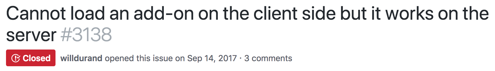
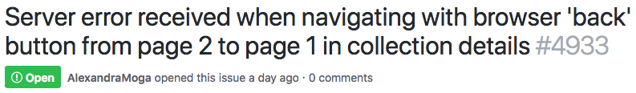
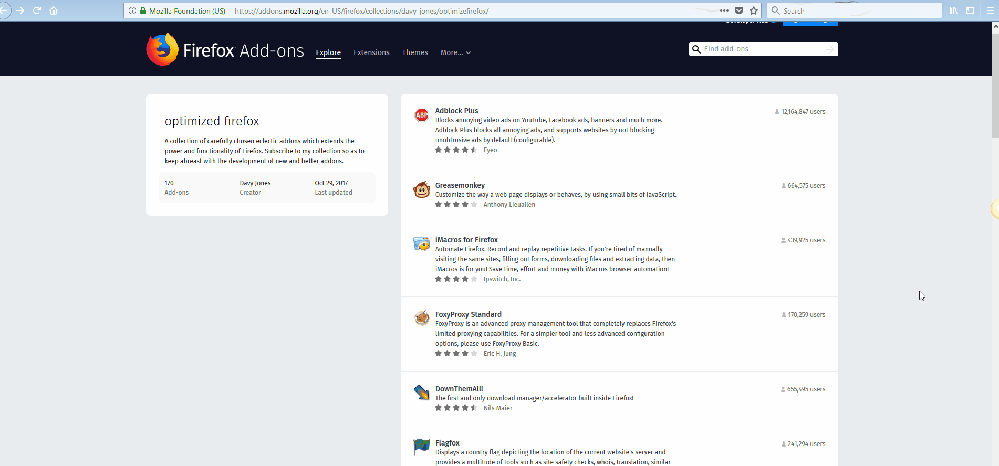
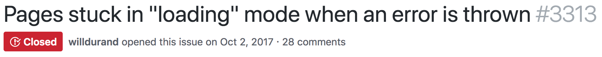
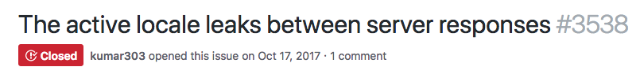
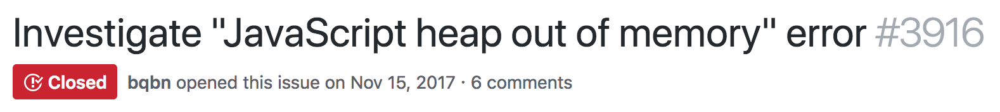
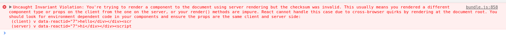

# addons.mozilla.org

Some lessons learnt.


## Double render is a fragile hack, do not use it 😅


## Always be careful

Undefined reference on the server == Error 500. #GameOver


## Error handling is tough

- Accurate HTTP status codes
- Correct error pages
- On both server and client


## Debugging made ~~easy~~ complex

- Isomorphic logging layer but no dev tools
- `disableSSR` config option to the rescue!
    - but some issues are hidden


### Server logs 😱

```
[...]
INFO: proxy: 302 ~> http://127.0.0.1:3333/service-worker.js (app=amo)
INFO: proxy: 200 ~> https://addons-dev.allizom.org/api/v3/accounts/account/mozilla/collections/privacy-matters/addons/?page=1&lang=en-US&wrap_outgoing_links=true (app=amo)
INFO: proxy: 200 ~> https://addons-dev.allizom.org/api/v3/accounts/profile/?wrap_outgoing_links=true (app=amo)
INFO: proxy: 200 ~> https://addons-dev.allizom.org/api/v3/accounts/account/mozilla/collections/trending-add-ons/addons/?page=1&lang=en-US&wrap_outgoing_links=true (app=amo)
WARN: server: restrictSearchResultsToAppVersion config set; not setting "compatibleWithVersion" to current application version, even though it's above 57. (app=amo)
WARN: server: restrictSearchResultsToAppVersion config set; not setting "compatibleWithVersion" to current application version, even though it's above 57. (app=amo)
WARN: server: restrictSearchResultsToAppVersion config set; not setting "compatibleWithVersion" to current application version, even though it's above 57. (app=amo)
INFO: proxy: 200 ~> https://addons-dev.allizom.org/api/v3/addons/search/?app=firefox&page_size=4&sort=rating&type=persona&lang=en-US&wrap_outgoing_links=true (app=amo)
INFO: proxy: 200 ~> https://addons-dev.allizom.org/api/v3/addons/search/?app=firefox&page_size=4&sort=users&type=extension&lang=en-US&wrap_outgoing_links=true (app=amo)
INFO: proxy: 200 ~> https://addons-dev.allizom.org/api/v3/addons/search/?app=firefox&featured=true&page_size=4&sort=random&type=extension&lang=en-US&wrap_outgoing_links=true (app=amo)
INFO: server: Second component render after sagas have finished (app=amo)
INFO: proxy: 200 ~> http://127.0.0.1:3333/en-US/firefox/ (app=amo)
WARN: server: CSP has been disabled from the config (app=amo)
INFO: server: Prepending lang to URL: en-US (app=amo)
INFO: server: Prepending application to URL: firefox (app=amo)
INFO: server: (app=amo, start=2018-05-06T14:47:55.020Z, finish=2018-05-06T14:47:55.021Z, elapsed=1, req.remoteAddress=127.0.0.1, req.remotePort=57189)
```


## New fun bugs 🤷‍♂️






### Example




## No random allowed



> There is a [React RFC for introducing isomorphic
IDs](https://github.com/reactjs/rfcs/pull/32).


## Security considerations

- State serialization
- Sensitive data on the server, _e.g._, env vars


## You must have a fresh, isolated server context




### Example

```shell
$ repeat 10 curl https://addons.mozilla.org/en-US/firefox/addon/adblock-plus/ -s \
  | grep --color -oE 'updated</dt><dd data-reactid=\"\d+\">.+?</dd>'

updated</dt><dd data-reactid="194">il y a 2 jours (6 nov. 2017)</dd>
updated</dt><dd data-reactid="194">2 days ago (Nov 6, 2017)</dd>
updated</dt><dd data-reactid="194">2 days ago (Nov 6, 2017)</dd>
updated</dt><dd data-reactid="194">2 hari yang lalu (6 Nov 2017)</dd>
updated</dt><dd data-reactid="194">2 days ago (Nov 6, 2017)</dd>
updated</dt><dd data-reactid="194">2 days ago (6 Nov 2017)</dd>
updated</dt><dd data-reactid="194">2 dias atrás (6 de nov de 2017)</dd>
updated</dt><dd data-reactid="194">2 days ago (Nov 6, 2017)</dd>
updated</dt><dd data-reactid="194">2 天前 (2017年11月6日)</dd>
updated</dt><dd data-reactid="194">2 days ago (Nov 6, 2017)</dd>
```


## You need more servers



_In order to reduce the # of 500 caused by the issue, we had to bump up the # of
instances in the cluster from 8 to 40. And that eventually stopped the "heap
oom" from continuously happening._


## React has useful dev warnings



TL;DR: React on the client does not generate the same HTML sent by the server:
there is a bug.
