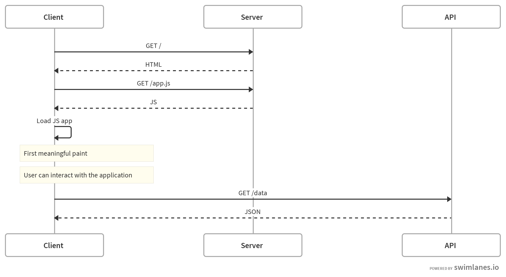

# A bit of history

## Before 2010

- Server side frameworks
- Template engines
- jQuery, Yahoo UI
- `script.aculo.us` ❤️
- `XMLHttpRequest`

## 2011

- Backbone.js is 3 months old
- Node.js is 2 years old
- People read Fielding's dissertation (REST)

 

#### Let's write client side applications in JavaScript! 😎

## Client Side Rendering 

## 2013

- React initial release

 

#### Interesting, but what is this Flux architecture again? 🤔

## 2015

- Vue.js is 1 year old
- Redux initial release

 

#### Problem(s) solved &nbsp;🎉

## Since then...

_“Can we render this JavaScript app on the server?”_

 

