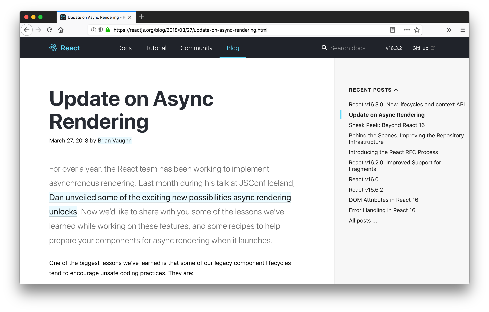

# Server Side Rendering

## The big picture 

## How it works

On every incoming request, the server:

1. creates the store/initial app state
2. matches the URL to find the right component
3. loads the component and gets the HTML
4. sends the HTML back to the client

Then, the client loads the JavaScript app.

## Benefits?

- Accessibility (limited)
- Better performances (first meaningful paint)
- Better user experience (JS disabled)
- Search Engine Optimization/Social sharing

### Googlebot

- Quite good at browsing JS apps
- Give up after ~10 seconds
- Some issues with `react-router`

> Source: [Testing a React-driven website’s SEO using “Fetch as
> Google”](https://medium.freecodecamp.org/using-fetch-as-google-for-seo-experiments-with-react-driven-websites-914e0fc3ab1),
> Nov. 2016.

## Drawbacks?

- **Makes everything very complicated**
- Time To First Byte (TTFB) usually slower (but Cloudfare says
  it's fine in [1])
- React `renderToString()` holds the event loop [2], probably also the case for
  other frameworks

> [1]: [Stop worrying about Time To First Byte
> (TTFB)](https://blog.cloudflare.com/ttfb-time-to-first-byte-considered-meaningles/)
>  
> [2]: [The Benefits of Server Side Rendering Over Client Side
> Rendering](https://medium.com/walmartlabs/the-benefits-of-server-side-rendering-over-client-side-rendering-5d07ff2cefe8)

## Why is it so complicated?

1. Two different environments, one codebase
2. Cookies, redirects/errors, HTTP statuses
3. Data fetching **before** rendering

### 1. Two different environments, one codebase

&plus; **isomorphic libraries** and polyfills

### 2. Cookies, redirects/errors, HTTP statuses

You have to find ~~hacks~~ nice tricks 👻

### 3. Data fetching **before** rendering

There used to be two approaches...

- static `async` method to fetch data and `Promise.all()` on the server
- double render 💔

